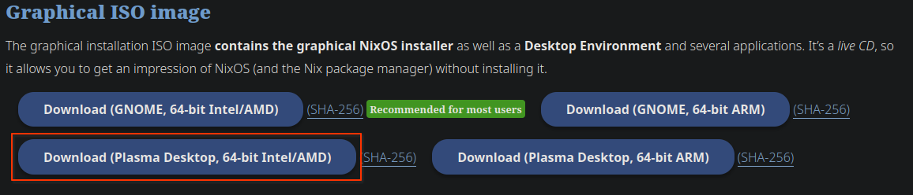
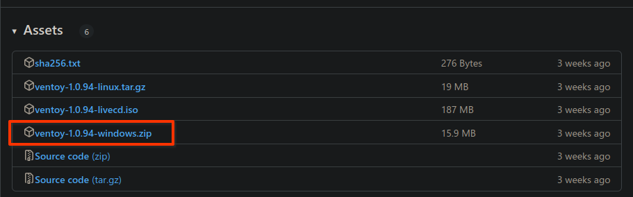
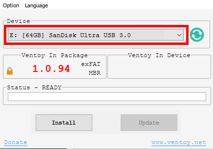
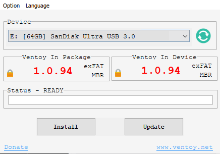
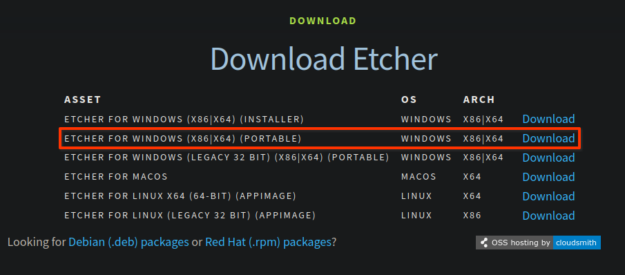
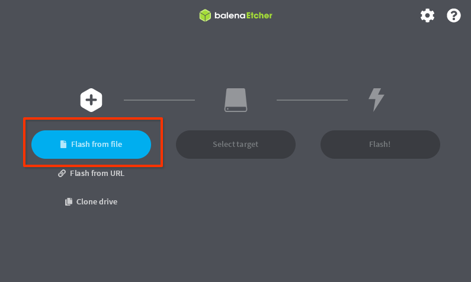
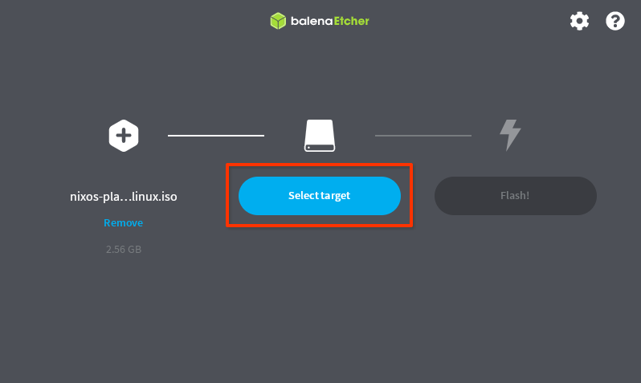
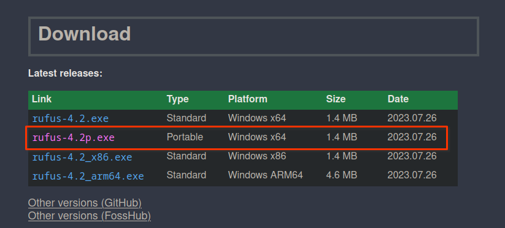

# Step by step guide to your first time in Linux!

### This is an in-depth guide you through your first time using linux from being a complete beginner with computers. 

### The method in this guide doesn't require you to install linux to try it out, however there will be instructions on how to do that as well.

### Contents
1. [Prep. Shopping list, terms, and imformation](#shopping_list)
    1. [Some important terms](#terms)
2. [Step 1. Getting Linux on your USB](#step1)
    1. [Option 1. Ventoy](#o1ventoy)
        1. [Downloading Ventoy](#dlventoy)
        2. [Setting up Ventoy](#suventoy)
        3. [Using Ventoy](#useventoy)
        4. [Putting your ISO on your USB](#isotoventoy)
    2. [Option 2. Balena Etcher](#o2balena)
        1. [Downloading Balena](#dlbalena)
        2. [Using Etcher](#useetcher)
    3. [Option 3. Rufus](#o3rufus)
        1. [Downloading Rufus](#dlrufus)
        2. [Using Rufus](#userufus)
3. [Step 2. Booting into Linux](#step2)
    1. [Getting to your boot menu](#bootmenu)
    2. [Navigating Ventoy](#navventoy)
    3. [The Live Environment](#liveenv)
4. [Step 3. Learning Linux](#step3)

# Prep. Shopping List, terms and information

### These are the things that you'll need to follow along with this guide. You probably already have these items laying around!

1. Usb drive with at least ~8GB or more. (you can probably get away with less, around 4GB, but you'll be pretty limited as to what you can do)

2. A pc running windows with a usb port. (while you *can* do this on an intel based mac but it's not covered in this guide)

3. A Linux ISO.  For this guide we'll be using NixOS as it's built to be stable and repeatable. https://nixos.org/download

#### NOTE: You can use any distro you like. This guide just covers NixOS but the steps until [Step 3.](#step3) are identical

Scroll down until you find this section and click Download. (We'll be using the Plasma version as it's more Windows like and should be more farmiliar to you. You may choose the gnome version if you'd like but that's not covered in this guide)

4. A tool to get the linux ISO on to the usb. (This will be covered in [Step 1.](#step1))

### Some important terms

- ISO: An ISO, also known as an *image*, is an archive, usually as a backup of optical media like CD's. In this case it's used to distribute a copy of linux. Not too different from physical install disks from back in the day.

- Distro: Distro, or distribution refers to the distribution of linux as there are many to chose from. Think of it like a supermarket. Target, Walmart, Whole Foods, Aldi, would be the distributions or different choices under the umbrella term of "supermarket".

- Linux: Linux refers to the Kernel that tells everything else what to do.  
For more context (and an inside joke with the linux community) see this copypasta https://stallman-copypasta.github.io/

- Kernel: The kernel is a computer program at the core of a computer that communicates between programs and things like your mouse and keyboard and tells everything what to do.  
For more info see this wikipedia article https://en.wikipedia.org/wiki/Kernel_%28operating_system%29

- DE: DE is short for Desktop Environment. A Desktop Environment is a bundle of programs that allow you to interact with your computer. Think of your task bar and start menu. That's all part of the DE. In the case of this guide we'll be using one called Plasma by KDE. gnome is also a different DE.  
For more info see this wikipedia article https://en.wikipedia.org/wiki/Desktop_environment

- WM: WM is short for Window Manager. A Window Manager is software that, as the name implies, manages your windows (the little boxes of programs that show up on your screen like google). The window manager mainly handles their position and how they move around, though that's a gross oversimplification.  
For more info see this wikipedia article https://en.wikipedia.org/wiki/Window_manager

# Step 1. Getting Linux on your USB

## For putting Linux on the USB we have a few options. Doing any one of which will remove everything on your USB drive so make sure you have everything backed up.

## Option 1. Ventoy (We'll be using this option for the rest of the guide.)

#### NOTE: Ventoy creates a bootloader (This will be covered in [Learning Linux](#step3)) on your USB drive that will allow you to select whatever ISO you want (as long as it's on the USB drive). It also allows you to quickly chose between whatever distro's ISO you have on your ventoy

### Downloading Ventoy

Download link: https://github.com/ventoy/Ventoy/releases

You'll want the one with windows.zip at the end. As ventoy gets updated the verison number will change. As of making this guide it's 1.0.94.

### Setting up Ventoy

There's a more informative guide on how to do this here: https://www.ventoy.net/en/doc_start.html

#### NOTE: The above guide doesn't cover things super in-depth so if you're a total novice it may be intimidating.

First, unzip the .zip that you downloaded. To do this open file explorer and find the .zip file you just downloaded (probably in your downloads). Right click on the file and click extract here. This will make a folder named the same as the zip file. 

(Optionally If you want to be organized i suggest putting the ventoy folder in your documents folder for easy access. Now it won't get lost in your downloads.) (If you don't see the .zip at the end don't worry. Go to the view tab at the top of file explorer, and click the "Show file extensions" check box. You should now be able to see the .zip)

Now, plug in your USB drive and you're ready to use ventoy.

### Using Ventoy

#### NOTE: If you've already installed ventoy on your USB you can skip to [Putting Your ISO on your USB](#isotoventoy).

First, run the file named "Ventoy2Disk.exe". This will be in that folder you just extracted. (If you don't see the .exe at the end don't worry. Go to the view tab at the top of file explorer, and click the "Show file extensions" check box. You should now be able to see the .exe)

You can either double click it(left click). Or right click it and select run as admin.(NOTE: Running as admin may fix some issues when running ventoy so it is generally suggested to use this method) This should open the ventoy tool.

Now that you have ventoy open we're ready to install it to your USB. To do this, look under device and make sure you have the correct drive selected. This should be your USB that you're installing to. 

If it's not already shown there click the little down arrow on the right side of the device box and select your USB drive from the drop down. 

Once you have your USB drive selected, click Install and let it do it's thing.

When it's done the boxes "Ventoy in Package" and "Ventoy in Device" should match

### Putting Your ISO on your USB

Putting your ISO on your USB is quite simple. Open file explorer and go to where you downloaded your NixOS ISO (probably in your downloads). Then, on the left find where your USB drive is. If there are two partitions or two USB drives showing up, you'll want the larger one. (there may be two showing up as one is the ventoy partition which is what boots up so you can select what iso you want to use. The other, larger one, is where you will store your ISO's. The best part is you can add as many as you can fit on your USB.) 

Now that you've located your USB drive, simply drag and drop the ISO from your downloads to your USB. {idk if it asks to move or copy but here's this in case. "if it asks you to move or copy, selecting copy will leave a copy behind in case you want it for later."}

You now have your ISO on your USB and you're ready for [Step 2.](#step2) No need to un-plug as we'll be using it shortly.

## Option 2. Balena Etcher

Balena Etcher etches or burns the image on to that USB. Similar to burning a CD back in the day. This means that you will only be able to boot to that single ISO or image that's burned to that USB drive. Though much more limited this method is alot simpler and will serve it's purpose for this guide.

#### NOTE: You can use your USB drive for other things after this. You'll just have to format your drive.

### Downloading Balena Etcher

Doanload link: https://etcher.balena.io/#download-etcher

For Balena Etcher we'll use the portable version as it skips the need to install.

Now plug in your USB drive and you're ready to use etcher.

### Using Etcher

To open Etcher, simply run the .exe you just downloaded (probably in your downloads). (If you don't see the .exe at the end don't worry. Go to the view tab at the top of file explorer, and click the "Show file extensions" check box. You should now be able to see the .exe)  

To run the .exe you can either double click it (left click). Or right click it and select run as admin.(NOTE: Running as admin may fix some issues when running Etcher so it is generally suggested to use this method) This should open Etcher.

Now that Etcher is open you should see an big button on the left saying "Flash from file". Click that button and select the NixOS ISO that you downloaded in [Prep. Shopping List](#shopping_list). (probably in your downloads)

Once you have your ISO selected make sure you have your USB drive selected. If it's not already selected click the "change" button in the middle and select the correct drive.

{image of the drive select menu that opens here}

Make sure everything is correct and if it is, click the big flash button and let it do it's thing. Let it finish and when it does, you're ready to use your USB. No need to un-plug it as we'll be using it in [Step 2.](#step2)

### Option 3. Rufus

#### NOTE: Rufus creates a bootable install of linux (or whatever os you chose) and does not give you the ability to install to a disk (your pc) or run the live environment later on.

### Downloading Rufus

Download Link: https://rufus.ie/

Scroll down a bit until you see the download section. You'll want the one with p.exe at the end. This signifies it's the portable version. We'll be using the portable version as it skips the need to install.

Now plug in your USB drive and you're ready to use Rufus.

### Using Rufus

To open Rufus, simply run the .exe you just downloaded (probably in your downloads). (If you don't see the .exe at the end don't worry. Go to the view tab at the top of file explorer, and click the "Show file extensions" check box. You should now be able to see the .exe)  

To run the .exe you can either double click it (left click). Or right click it and select run as admin.(NOTE: Running as admin may fix some issues when running Rufus so it is generally suggested to use this method) This should open Rufus.

# Step 2. Booting into Linux

Booting into Linux is the final hurdle before you can start learning about it, and using it.

#### NOTE: Nothing you do will get saved in the live environment. (This will be explained later in [The Live Environment](#liveenv))

## Getting to your boot menu

The boot menu is what you will use to select your USB drive with Linux on it. The boot menu is part of your computer, more specifically the Bios on the motherboard.

To get to your Boot menu you will need to hold a key while your computer is booting.

This blog post has some good resources to find what key that may be. Most commonly it will be F12, F10, F8, or esc. (On laptops these may be on your number keys and you might have to hold fn as well)  

https://techofide.com/blogs/boot-menu-option-keys-for-all-computers-and-laptops-updated-list-2021-techofide/#Boot%20Menu

## Navigating Ventoy

## The Live Environment

The live environment is where you can use fully featured linux without having to install. as mentioned before nothing you do here will get saved. You'll have to install for thatl

# Step 3. Learning Linux

# Step 4. 

